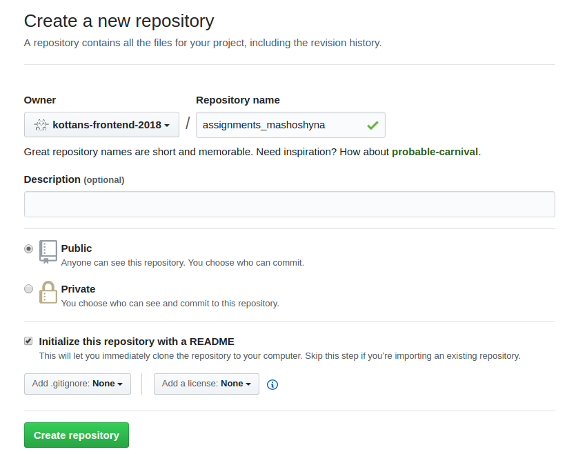
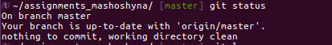
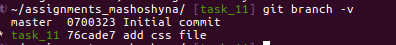
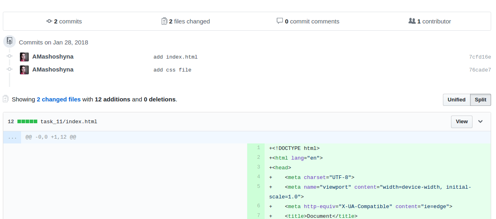
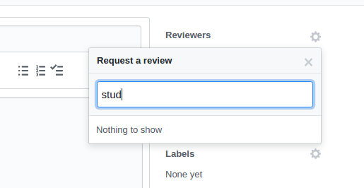

### Как сделать пул-реквест (пошаговая инструкция)
1. Создать репозиторий в организации `kottans-frontend-2018`.

Назвать репозиторий  `assignments_username`, где `username` - ваше имя на ГибХабе. Отметить галочкой “Initialize with README”.

2. Клонировать репозиторий на свой компьютер: скопировать адрес в выпадающем меню `Clone or Download`

Перейти в консоль и ввести `git clone <repository address>`

3. Зайти в директорию со склонированным проектом (`cd assignments_username`). Можно посмотреть, что получилось (`git status`) и убедиться, что мы находимся на ветке `master`, локальная ветка `master` синхронизирована с удаленной, неучтенных изменений нет.

4. Сразу в ветку `master` коммитить изменения не будем, поэтому создадим новую ветку и переключимся на нее. Нужная команда: `git checkout -b task_11`, где `task_11` - желаемое название ветки.

5. Далее открываем проект в любимом редакторе и выполняем задание (или копируем файлы, если задание выполнено и сохранено в другое место). Коммитим сделанные изменения. Я для примера добавила файлы index.html styles.css. Теперь в ветке `task_11` есть коммиты, которых нет в ветке `master` (ни в локальной, ни в удаленной).

“Initial commit” создался автоматически при создании репозитория, а “add css file” - последний, сделанные мной.
6. Далее нужно отправить ветку `task_11` на сервер. Для этого набираем `git push origin task_11`, где `origin` - имя удаленного репозитория (задается по умолчанию), `task_11` - имя ветки, которую мы хотим отправить. Если такой ветки в удаленном репозитории, гит сам создаст одноименную.

7. Далее переходим в веб-интерфейс ГитХаба. ГитХаб сообщает, что появилась новая ветка, и предлагает сделать пул-реквест.

Если не предлагает, не страшно: заходим на вкладку `branches` и нажимаем `new pull request`

Открывается форма создания пул-реквеста. В заголовке мы видим, что этот пул-реквест внесет изменения из ветки `task_11` в ветку `master`.

Скроллим вниз и видим, какие именно изменения будут внесены:

Убеждаемся, что не закоммитили и не запушили чего-то лишнего и нажимаем “Create pull request”
8. Далее нужно запросить ревью . Для этого в той же форме справа есть кнопка `Request review`. Выбираем группы `students` и `mentors`.

Может быть так, что вариантов `students` и `mentors`  в выпадающем списке нет.

Это значит, что я еще не успела добавить ваш репозиторий в список репозиториев команд. Надо подождать или написать мне сообщение в гиттере.

9. Статусы пул-реквестов можно смотреть на вкладке `Pull requests` на главной странице ГитХаба. 

- `Created` - это ваши пул-реквесты (созданные вами)
- `Assigned` - пул-реквесты, которые вам поручили (у нас такого пока нет)
- `Mentioned` - те, где вас упомянули по имени в обсуждении
- `Review request` - те, где у вас запрашивают ревью (лично или в составе команды).

То есть, самые интересные вкладки на сейчас - `Created` и `Review request`.

10. Как обновить пул-реквест
Допустим, вы отправили пул-реквест, получили замечания и внесли изменения. Чтобы обновить пул-реквест, нужно закоммитить изменения в ту же ветку и отправить на сервер (`git push`). Пул-реквест обновится автоматически.

11. Что делать, если что-то пошло не так
Во-первых, не волноваться. Гит сделан так, что сделать что-то необратимое довольно сложно. Почитать внимательно сообщение об ошибке: часто в нем уже содержатся рекомендации, как можно исправить ситуацию. Погуглить ошибку. Спросить в чате.

