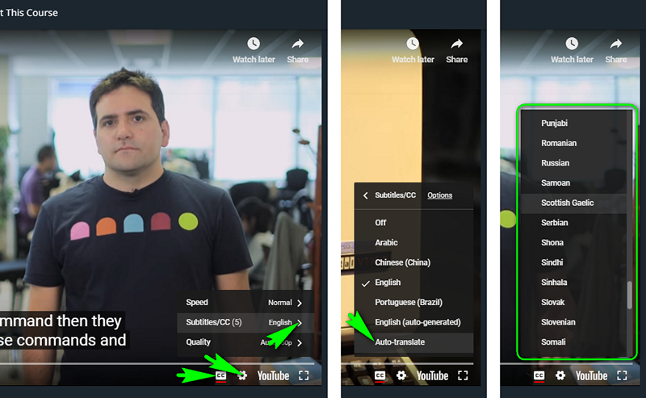

[![MIT Licensed][icon-mit]][license]
[![Awesome][icon-awesome]][awesome]
&nbsp;&nbsp;&nbsp;&nbsp;&nbsp;&nbsp;
[![Telegram][icon-chat]][chat]

# Git and GitHub

Get familiar with Git and GitHub.

 1. Finish the course [Version Control with Git](https://www.udacity.com/course/version-control-with-git--ud123)

    You may resort to subtitles/closed captions and
    to auto-translated subtitles in particular if you feel
    it would help you to master the video course better.

    

 1. Complete the following levels at [learngitbranching.js.org](https://learngitbranching.js.org/):
    - Main: Introduction Sequence
    - Remote: Push & Pull -- Git Remotes

 1. Create repository named `kottans-frontend`.

 1. Create `README.md` for the repository.

 1. Describe your impressions about learned materials.

 1. Send a pull-request to [Kottans/mock-repo][mock-repo] proposing a change.
 
    **How to make a pull-request**
 
    * Fork this repo [Kottans/mock-repo][mock-repo]
    * Clone your fork to your local machine: `git clone https://github.com/YOUR_USERNAME/mock-repo.git`
    * Add this repository [Kottans/mock-repo][mock-repo] as an upstream: git remote add upstream `https://github.com/kottans/mock-repo.git`
    * `git checkout master` and then create new branch, naming is up to you (aka feature branch): `git checkout -b BRANCH_NAME`.
    * Make some changes to your local repository. It could be anything, really. If you have found a typo in README - great!
    Take care to give your PR a meaningful name and description.
    * Сommit your changes to newly created feature branch
    * Сheckout master branch: `git checkout master`
    * Pull latest changes from upstream master branch: `git pull upstream master`
    * Merge master branch into your feature branch: `git checkout BRANCH_NAME && git merge master`
    * Resolve any merge conflicts if there are any
    * Push feature branch to your remote repository: `git push --set-upstream origin BRANCH_NAME`
    * Make pull-request from your repository to [this][mock-repo] repository via GitHub web-interface
    * If you are asked to fix a merge conflict refer to the extra materials for the related information

    **Please note, that your PR may not be reviewed quickly.**

 1. Study Extra Materials below to improve your skills.
    If you feel it affects your overall course performance consider
    reverting to those later e.g. when you have all mandatory tasks completed.

When you finish this task you can start the next one.

## Extra Materials

* [Git за 30 хвилин](https://codeguida.com/post/453)

* [Git tips](http://sixrevisions.com/web-development/git-tips/) — consolidate your knowledge of Git

* [About Merge Conflicts](https://docs.github.com/en/free-pro-team@latest/github/collaborating-with-issues-and-pull-requests/about-merge-conflicts)

* [Resoilving a Merge Conflict](https://docs.github.com/en/free-pro-team@latest/github/collaborating-with-issues-and-pull-requests/resolving-a-merge-conflict-using-the-command-line)

* [Communicating using Markdown](https://lab.github.com/githubtraining/communicating-using-markdown)

* [Learn anything front-end](https://learn-anything.xyz/web-development/front-end)

* [TypingClub](https://www.typingclub.com/) — improve your typing speed

* [Как учиться и справляться с негативными мыслями](https://guides.hexlet.io/learning/)

## Done?

➡️ Go forward to [Linux, Command Line, HTTP Tools](linux-cli-http.md)

⤴️ Back to [Contents](../contents.md)

[icon-chat]: https://img.shields.io/badge/chat-on%20telegram-blue.svg
[icon-mit]: https://img.shields.io/badge/license-MIT-blue.svg
[icon-awesome]: https://cdn.rawgit.com/sindresorhus/awesome/d7305f38d29fed78fa85652e3a63e154dd8e8829/media/badge.svg

[license]: https://github.com/Kottans/web/blob/master/LICENSE.md
[awesome]: https://github.com/sindresorhus/awesome#front-end-development
[chat]: https://t.me/joinchat/CX8EF1JmLm9IM6J6oy2U7Q

[mock-repo]: https://github.com/Kottans/mock-repo
