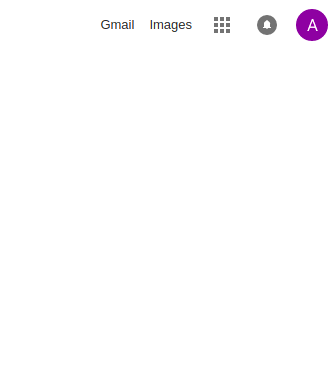
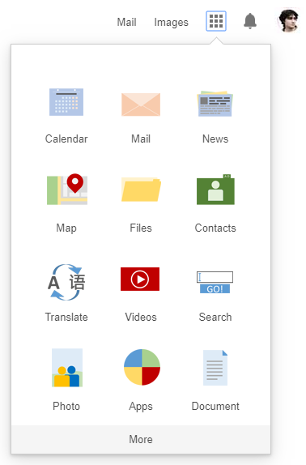
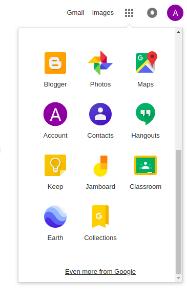
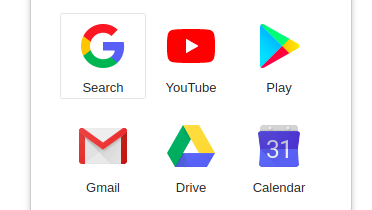
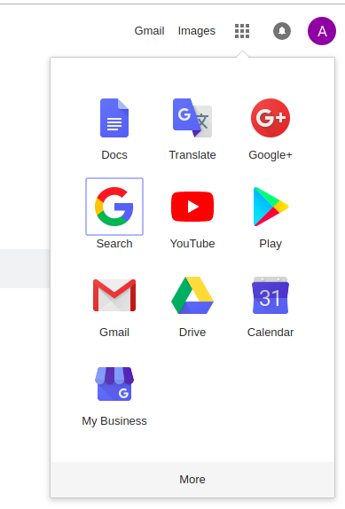

[![MIT Licensed][icon-mit]][license]
[![Awesome][icon-awesome]][awesome]
&nbsp;&nbsp;&nbsp;&nbsp;&nbsp;&nbsp;
[![Telegram][icon-chat]][chat]

# HTML & CSS practice: Hooli-style Popup

> **Hooli** is a fictitious corporation from
> [Silicon Valley TV series](https://www.imdb.com/title/tt2575988/).
> Many believe it impersonates Google or Apple.
> Hooli on [Silicon Valley famdom wiki](https://silicon-valley.fandom.com/wiki/Hooli). 
> It is also represented [on the web](http://www.hooli.xyz/).
  
The goal of this task is to practice coding HTML & CSS from mockup. You are expected to deepen your knowledge of HTML & CSS and discover new previously unknown features.

Requirements:
- no JavaScript, only HTML/CSS, use of preprocessors is allowed
- no external libraries or frameworks
- browser support: Chrome only (feel free to use latest features)

:warning: 

The above may happen if your design mimics Google components or services
as they may decide that you've created a phishing site to steal
your visitors' Google credentials.

To avoid this
- DO NOT use word "google", "apple", "amazon" or any other brand in
  - your project/repo name
  - any urls
  - any css selectors
  - any HTML elements ids (including created with JS) or elsewhere across HTML
- DO NOT replicate Google design (layout structure, styles etc)
- DO NOT use Google icons
   
The popup is expected to have three states depending on click on the Google App button (third element from left in the top row). After first click the popup appears. After second click it is hidden. When popup is visible, click on "More" button adds 10 more icons and forces the content of the popup to scroll.
Mobile view is irrelevant for this task.

Initial state: non pop-up visible:

Active state:

Scrollable state:

All interactive elements should be marked as such on mouse hover.

All interactive elements should have `:focus` state.

Feel free using [our icons](https://github.com/kottans/frontend/raw/master/img/popup-icons.zip).

You may want to publish your results on
[GitHub Pages](https://help.github.com/articles/configuring-a-publishing-source-for-github-pages/)

**When complete do the following:**
1. You will require code review for this task:
   - For **Frontend 2021** course students: please, follow [these instructions](https://github.com/kottans/frontend-2021-homeworks/blob/master/README.md)
   - For **p2p course** students: please, follow [these instructions](https://github.com/kottans/frontend-2019-p2p/blob/master/CONTRIBUTING.md)
1. Great job! Go ahead and share your progress with others –
   post a message in [course channel][chat]:
   `HTML-CSS-Popup — #done` (or `HTML-CSS-Popup — #p2p_done` if you are p2p course student) and add the link to your repo. **This step is important, as it helps mentors to track your progress!**

When you finish this task you can proceed to the next one.

## Done?

➡️ Go forward to [JavaScript Basics](js-basics.md)

⤴️ Back to [Contents](../contents.md)

[icon-chat]: https://img.shields.io/badge/chat-on%20telegram-blue.svg
[icon-mit]: https://img.shields.io/badge/license-MIT-blue.svg
[icon-awesome]: https://cdn.rawgit.com/sindresorhus/awesome/d7305f38d29fed78fa85652e3a63e154dd8e8829/media/badge.svg

[license]: https://github.com/Kottans/web/blob/master/LICENSE.md
[awesome]: https://github.com/sindresorhus/awesome#front-end-development
[chat]: https://t.me/joinchat/CX8EF1JmLm9IM6J6oy2U7Q
