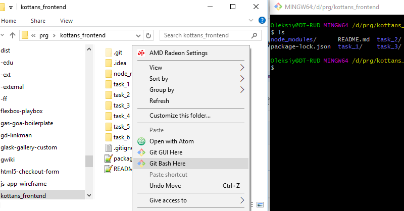

[![MIT Licensed][icon-mit]][license]
[![Awesome][icon-awesome]][awesome]
&nbsp;&nbsp;&nbsp;&nbsp;&nbsp;&nbsp;
[![Telegram][icon-chat]][chat]

# Linux, Command Line, HTTP Tools

Вивчіть деякі інструменти command line, сервера та http.
**Якщо вам важко сприймати інформацію англійською, ви завжди можете скористуватися будь-яким перекладачем**

1. [Linux Survival (4 modules)](https://linuxsurvival.com/linux-tutorial-introduction/)

   **Примітка для користувачів Windows:** Цей курс забезпечує віртуальне середовище для
   введіть команди. Однак, якщо ви хочете пізніше використовувати ці команди на практиці,
   вам потрібно буде працювати з Linux CLI, оскільки багато команд не підтримуються
   Windows `cmd` або PowerShell. Ви повинні вже встановити `git` з [git-scm.com](https://git-scm.com/downloads).
   Він пропонує Git Bash, який можна використовувати для введення команд bash.

   Клацніть правою кнопкою миші в будь-якому місці провідника та виберіть
   параметр `Git Bash here`.

   

1. [HTTP: Протокол, який повинен розуміти кожний веб-розробник - Частина 1](https://code.tutsplus.com/uk/tutorials/http-the-protocol-every-web-developer-must-know-part-1--net-31177)

1. [HTTP: Протокол, який повинен розуміти кожний веб-розробник - Частина 2](https://code.tutsplus.com/uk/tutorials/http-the-protocol-every-web-developer-must-know-part-2--net-31155)

<!-- [Web Development](https://www.udacity.com/course/web-development--cs253) -->
<!-- [Designing RESTful APIs](https://www.udacity.com/course/designing-restful-apis--ud388) -->

Завершіть курс (1), а також прочитайте статті (2) і (3) вище.

Після завершення виконайте наступне:
1. Зробіть скріншот своїх завершених уроків з (1)
   і помістіть скріншот в теку `task_linux_cli`
   вашого репо `kottans-frontend`.
1. В вашому `kottans-frontend` репо `README.md`:
   - додайте заголовок `## Linux CLI, and HTTP`
   - додати скріншот або додати посилання на скріншот
   - перерахуйте свої міркування щодо кожного пункту завдання
     (_що для вас було новим_, _що вас здивувало_, _що ви плануєте використовувати в майбутньому_)
1. Чудова робота! Діліться своїми досягненнями з іншими –
   опублікувати повідомлення в [course channel][chat]:
   `Linux CLI and HTTP — #done` (або `Linux CLI and HTTP — #p2p_done` якщо ви студент курсу p2p) і додайте посилання до свого репо. **Цей крок важливий, оскільки він допомагає менторам відстежувати ваш прогрес!**
1. Вивчіть додаткові матеріали нижче, щоб покращити свої навички.
    Якщо ви вважаєте, що це вплине на вашу загальну ефективність курсу, подумайте над тим, щоб
    повернутись до них пізніше, наприклад коли ви виконаєте всі обов’язкові завдання.
1. Ви можете пропустити опціональні матеріали з цього завдання (якщо такі є).

Коли ви закінчите це завдання, ви можете приступити до наступного.

## Додаткові матеріали

- [How I taught myself to code in eight weeks](http://lifehacker.com/how-i-taught-myself-to-code-in-eight-weeks-511615189)
- [How JavaScript works: Deep dive into WebSockets and HTTP/2 with SSE + how to pick the right path](https://blog.sessionstack.com/how-javascript-works-deep-dive-into-websockets-and-http-2-with-sse-how-to-pick-the-right-path-584e6b8e3bf7)

## Опціонально

1. [Command Line Power User](https://commandlinepoweruser.com/)

1. [Configuring Linux Web Servers](https://www.udacity.com/course/configuring-linux-web-servers--ud299)

1. [Networking for Web Developers](https://www.udacity.com/course/networking-for-web-developers--ud256)

## Готово?

➡️ Ідіть далі [Git for Team Collaboration](git-collaboration.md)

⤴️ Повернутися до [Contents](../contents.md)

[icon-chat]: https://img.shields.io/badge/chat-on%20telegram-blue.svg
[icon-mit]: https://img.shields.io/badge/license-MIT-blue.svg
[icon-awesome]: https://cdn.rawgit.com/sindresorhus/awesome/d7305f38d29fed78fa85652e3a63e154dd8e8829/media/badge.svg

[license]: https://github.com/Kottans/web/blob/master/LICENSE.md
[awesome]: https://github.com/sindresorhus/awesome#front-end-development
[chat]: https://t.me/joinchat/CX8EF1JmLm9IM6J6oy2U7Q
