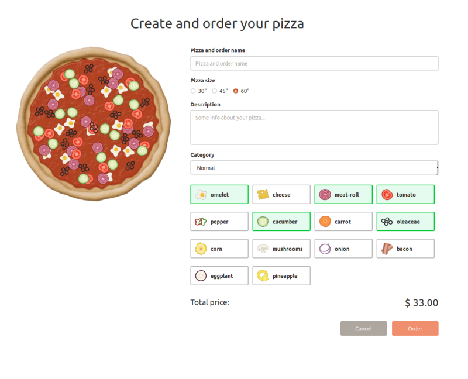

[![MIT Licensed][icon-mit]][license]
[![Awesome][icon-awesome]][awesome]
&nbsp;&nbsp;&nbsp;&nbsp;&nbsp;&nbsp;
[![Telegram][icon-chat]][chat]

# Task 14

Pizza App: Canvas

### Pizza Creation
When pizza manager creates new order with single pizza we want to have a pretty preview to be shown to user.
In order to do it we're going to use [Canvas API](https://developer.mozilla.org/en-US/docs/Web/API/Canvas_API).

#### Key Terms
- canvas
- multipart/formdata
- sprites
- canvas context
- blob

#### Task Description

- Create new page pizza ordering page with two key components - drawing board and ordering form.
- Fill ordering form with [ingredients](https://github.com/lempiy/Kottans-Pizza-Api/blob/master/docs/INGREDIENT.md#list) 
and [tags](https://github.com/lempiy/Kottans-Pizza-Api/blob/master/docs/TAG.md#list) checkboxes.
- Your page structure may look similar(not equal!) to image bellow.
- Your draw board should display empty crust on page init. Canvas size - 320x320 pixels.
- Upon choosing some of ingredients, draw board should display the ingredient layer on crust.
- Upon discarding some of ingredients, draw board should remove the ingredient layer from crust.
- Upon changing size of the pizza, crust and ingredients size should change too.
- Upon submit all user data including canvas blob snapshot should be sent to [server](https://github.com/lempiy/Kottans-Pizza-Api/blob/master/docs/PIZZA.md#create-pizza).
- Form should include validation according to [API](https://github.com/lempiy/Kottans-Pizza-Api/blob/master/docs/PIZZA.md#create-pizza) requirements.
- Pizza total price should be count according to formula: 

`pizza.size / 5 + Σ(ingredient[n].price + ... +ingredient[n+ingredient.length-1].price)`

- Create pizza page should be secured with authorization permissions.
- Background of output pizza image should be transparent.
- As always, feel free to ask your questions in our chat.

#### HAPPY DRAWING!

#### Resources

- [Canvas API](https://developer.mozilla.org/en-US/docs/Web/API/Canvas_API)
- [HTML Canvas API Tutorial](https://flaviocopes.com/canvas/)
- [FormData](https://developer.mozilla.org/en-US/docs/Web/API/FormData)
- [HTML5 Canvas Udacity course](https://www.udacity.com/course/html5-canvas--ud292)
- [Get blob from canvas](https://developer.mozilla.org/ru/docs/Web/API/HTMLCanvasElement/toBlob)

[icon-chat]: https://img.shields.io/badge/chat-on%20telegram-blue.svg
[icon-mit]: https://img.shields.io/badge/license-MIT-blue.svg
[icon-awesome]: https://cdn.rawgit.com/sindresorhus/awesome/d7305f38d29fed78fa85652e3a63e154dd8e8829/media/badge.svg

[license]: https://github.com/Kottans/web/blob/master/LICENSE.md
[awesome]: https://github.com/sindresorhus/awesome#front-end-development
[chat]: https://t.me/joinchat/CX8EF1JmLm9IM6J6oy2U7Q
